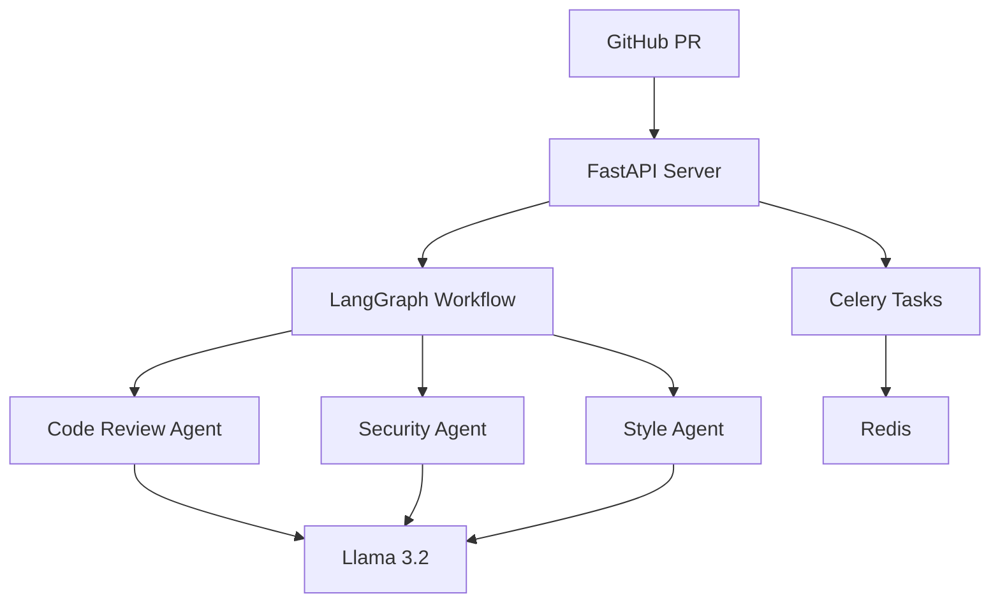

# 🔍 AI PR-Reviewer
An intelligent code review assistant powered by Llama 3.2 that automatically analyzes GitHub pull requests and provides detailed feedback using LangGraph workflows.

## ✨ Features

- Automated code review using Llama 3.2
- Advanced workflow management with LangGraph
- Multi-agent analysis system:
  - Code style and best practices review
  - Security vulnerability detection
  - Performance optimization suggestions
- Real-time analysis status tracking
- Asynchronous processing for large pull requests
- RESTful API interface
- Celery task queue with monitoring

## 🛠️ Tech Stack

- **Backend Framework**: FastAPI
- **LLM Engine**: Llama 3.2 (via Ollama)
- **Workflow Management**: LangGraph
- **Task Queue**: Celery with Redis
- **Monitoring**: Flower
- **Testing**: pytest

## 🚀 Getting Started

### Installation

1. Clone the repository
```bash
git clone git@github.com:YourUsername/pr-analysis-tool.git
cd pr-analysis-tool
```

2. Set up environment variables
```bash
cp .env.example .env
# Edit .env with your settings
```

3. Start the services
```bash
# Build and start all services
docker-compose up --build

# Or start in detached mode
docker-compose up -d
```

4. Check if services are running
```bash
# Check service status
docker-compose ps

# View logs
docker-compose logs -f web
```

## 📡 API Reference

### Start PR Analysis
```http
POST /api/v1/analyze-pr
```
```json
{
  "repo_url": "https://github.com/user/repo",
  "pr_number": 123,
  "github_token": "your_token"
}
```

### Check Analysis Status
```http
GET /api/v1/status/{task_id}
```

### Get Analysis Results
```http
GET /api/v1/results/{task_id}
```

Example response:
```json
{
    "task_id": "abc123",
    "status": "completed",
    "results": {
        "files": [{
            "name": "main.py",
            "issues": [{
                "type": "style",
                "line": 15,
                "description": "Line too long",
                "suggestion": "Break line into multiple lines"
            }]
        }],
        "summary": {
            "total_files": 1,
            "total_issues": 1,
            "critical_issues": 0
        }
    }
}
```

## 🧪 Development

### Running Tests
```bash
# Install test dependencies
pip install -r requirements.txt

# Run test suite
pytest

# Run with coverage
pytest --cov=src tests/
```

### Monitoring
- API Documentation: http://localhost:8000/docs
- Celery Flower Dashboard: http://localhost:5555

## 🏗️ Architecture



## 🚀 Deployment

### Using Docker
```bash
# Production deployment
docker-compose -f docker-compose.prod.yml up -d
```

### Manual Deployment
1. Set up a Redis instance
2. Install and configure Ollama with Llama 3.2
3. Configure environment variables
4. Start the FastAPI server and Celery workers

## 🔒 Security

- All GitHub tokens should be kept secure
- API endpoints are rate-limited
- Code analysis is performed in isolated environments
- No code is stored permanently

## 🤝 Contributing

1. Fork the repository
2. Create your feature branch
3. Commit your changes
4. Push to the branch
5. Create a Pull Request

## 📝 License

This project is licensed under the MIT License - see the [LICENSE](LICENSE) file for details.

## 🙏 Acknowledgments

- Llama 3.2 by Meta AI
- LangGraph and LangChain communities
- FastAPI framework